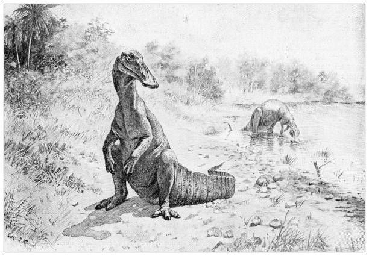

<h1 align="center">DinoDNS</h1>

<p align="center">
    <em>Lightweight DNS Server. Built to Resolve, Ready to Forward.</em>
</p>
<p align="center">
    
    
    
</p>
<p align="center">
    
</p>

---

## Table of Contents

- [Table of Contents](#table-of-contents)
- [Overview](#overview)
  - [Why DinoDNS?](#why-dinodns)
- [Getting started](#getting-started)
  - [Prerequisites](#prerequisites)
  - [Installation](#installation)
  - [Usage](#usage)
  - [Query Examples](#query-examples)
- [📘 DNS Catalog Schema (TOML)](#-dns-catalog-schema-toml)
  - [Overall Structure](#overall-structure)
    - [Supported Record Types](#supported-record-types)
      - [SOA (Start of Authority)](#soa-start-of-authority)
      - [NS (Name Server)](#ns-name-server)
      - [A (Address)](#a-address)
      - [CNAME (Canonical Name)](#cname-canonical-name)
  - [Complete Example](#complete-example)

## Overview

**DinoDNS** is a lightweight, developer-friendly DNS server designed for custom domain resolution, dynamic record handling, and log-friendly observability.

> Based on the specifications defined in [RFC 1035 – Domain Names: Implementation and Specification](https://www.rfc-editor.org/rfc/rfc1035).

### Why DinoDNS?

DinoDNS was built to offer a DNS server that’s:

- 🧩 **Configurable Zones**: Define DNS zones and records effortlessly using simple TOML files.
- ⚙️ **DNS Message Handling**: Parse, serialize, and respond to DNS queries with full protocol compliance.
- 📊 **Log-friendly**: Structured logs in `logfmt` format for easy integration with Promtail, Grafana, or any log pipeline.
- 🧪 **Ideal for local labs & testing**: No system-level DNS config required; just run and resolve.

---

## Getting started

### Prerequisites

This project requires the following dependencies:

- Python **≥ 3.13.3**
- [`uv`](https://github.com/astral-sh/uv) (recommended) or classic `pip`

### Installation

Using [`uv`](https://github.com/astral-sh/uv):

```bash
uv build
pipx install dist/dinodns-*.whl
```

### Usage

Run the project with:

- After [Installation](#installation) section:

```bash
dinodns --forward 1.1.1.1 Catalog.toml
```

- Or, using [`uv`](https://github.com/astral-sh/uv):

```bash
uv run -m dinodns.main --forward 1.1.1.1 Catalog.toml
```

### Query Examples

You can interact with DinoDNS using _standard_ DNS tools like `nslookup`:

<details>
<summary><strong>A Record</strong></summary>
<br>

```bash
nslookup jurassic.org. 127.0.0.1
```

Output:

```
Server:         127.0.0.1
Address:        127.0.0.1#53

Name:   jurassic.org
Address: 192.168.1.1
```

</details>

<details>
<summary><strong>CNAME Record</strong></summary>
<br>

```bash
nslookup -type=CNAME jurassic.org. 127.0.0.1
```

Output:

```
Server:         127.0.0.1
Address:        127.0.0.1#53

jurassic.org    canonical name = www.jurassic.org.
```

</details>

<details>
<summary><strong>NS Record</strong></summary>
<br>

```bash
dig NS jurassic.org. @127.0.0.1 +noadflag
```

> The Z field defined in [RFC 1035](https://www.rfc-editor.org/rfc/pdfrfc/rfc1035.txt.pdf) was later redefined by [RFC 2535](https://www.rfc-editor.org/rfc/rfc2535.html) introducing "DNS Security Extensions". The original 3 reserved bits are now interpreted as Z, AD (Authenticated Data), and CD (Checking Disabled).
> By default, dig sets the AD bit to 1, which results in a `Z=2` value if interpreted using the original RFC 1035 format. This causes compatibility issues with strict implementations like DinoDNS, which expect `Z=0`.
> To remain compliant with RFC 1035, disable the AD bit using the `+noadflag` option.

Output:

```
; <<>> DiG 9.10.6 <<>> NS jurassic.org. @127.0.0.1 +noadflag
;; global options: +cmd
;; Got answer:
;; ->>HEADER<<- opcode: QUERY, status: NOERROR, id: 53094
;; flags: qr aa rd; QUERY: 1, ANSWER: 1, AUTHORITY: 0, ADDITIONAL: 1
;; WARNING: recursion requested but not available

;; QUESTION SECTION:
;jurassic.org.                  IN      NS

;; ANSWER SECTION:
jurassic.org.           3600    IN      NS      ns1.jurassic.org.

;; ADDITIONAL SECTION:
jurassic.org.           3600    IN      A       192.168.1.1

;; Query time: 0 msec
;; SERVER: 127.0.0.1#53(127.0.0.1)
;; WHEN: Mon Jun 16 01:18:13 CEST 2025
;; MSG SIZE  rcvd: 100
```

</details>

<details>
<summary><strong>SOA Record</strong></summary>
<br>

```bash
nslookup -type=SOA jurassic.org. 127.0.0.1
```

Output:

```
Server:         127.0.0.1
Address:        127.0.0.1#53

\@
        origin = ns1.jurassic.org
        mail addr = admin.jurassic\.org
        serial = 2025061601
        refresh = 7200
        retry = 3600
        expire = 1209600
        minimum = 86400
```

</details>

---

## 📘 DNS Catalog Schema (TOML)

This TOML schema defines a **DNS catalog**, composed of multiple **zones**. Each zone contains a list of DNS records (`SOA`, `NS`, `A`, `CNAME`, etc.).

### Overall Structure

```toml
[[zones]]
origin = "<zone name, e.g. jurassic.org.>"

[[zones.records]]
domain-name = "<relative or absolute name, e.g. @ or ns1>"
ttl = <time-to-live in seconds, e.g. 3600>
class = "IN"
type = "<record type, e.g. A, NS, SOA, etc.>"
# ...additional fields depending on the record type
```

#### Supported Record Types

##### SOA (Start of Authority)

Defines authoritative information about the zone.

```toml
type = "SOA"
mname   = "<primary master name server>"
rname   = "<responsible email>"
serial  = <serial number, e.g. 2025061601>
refresh = <refresh interval (seconds)>
retry   = <retry interval>
expire  = <expire time>
minimum = <minimum TTL>
```

##### NS (Name Server)

Declares the name servers for the zone.

```toml
type = "NS"
nsdname = "<authoritative name server FQDN>"
```

##### A (Address)

Maps a domain name to an IPv4 address.

```toml
type = "A"
host-address = "<IPv4 address, e.g. 192.168.1.1>"
```

##### CNAME (Canonical Name)

Creates an alias for another domain name.

```toml
type = "CNAME"
cname = "<canonical target domain name>"
```

### Complete Example

```toml
[[zones]]
origin = "jurassic.org."

[[zones.records]]
domain-name = "@"
ttl = 3600
class = "IN"
type = "SOA"
mname = "ns1.jurassic.org."
rname = "admin@jurassic.org."
serial = 2025061601
refresh = 7200
retry = 3600
expire = 1209600
minimum = 86400

[[zones.records]]
domain-name = "@"
ttl = 3600
class = "IN"
type = "NS"
nsdname = "ns1.jurassic.org."

[[zones.records]]
domain-name = "ns1"
ttl = 3600
class = "IN"
type = "A"
host-address = "192.168.1.1"

[[zones.records]]
domain-name = "@"
ttl = 3600
class = "IN"
type = "A"
host-address = "192.168.1.1"

[[zones.records]]
domain-name = "@"
ttl = 3600
class = "IN"
type = "CNAME"
cname = "www.jurassic.org."

[[zones]]
origin = "cretaceous.org."

[[zones.records]]
domain-name = "@"
ttl = 3600
class = "IN"
type = "SOA"
mname = "ns1.cretaceous.org."
rname = "admin@cretaceous.org."
serial = 2025061601
refresh = 7200
retry = 3600
expire = 1209600
minimum = 86400

[[zones.records]]
domain-name = "@"
ttl = 3600
class = "IN"
type = "NS"
nsdname = "ns1.cretaceous.org."

[[zones.records]]
domain-name = "@"
ttl = 3600
class = "IN"
type = "A"
host-address = "127.0.0.1"

[[zones.records]]
domain-name = "ns1"
ttl = 3600
class = "IN"
type = "A"
host-address = "127.0.0.1"

[[zones.records]]
domain-name = "@"
ttl = 3600
class = "IN"
type = "CNAME"
cname = "www.cretaceous.org."
```
